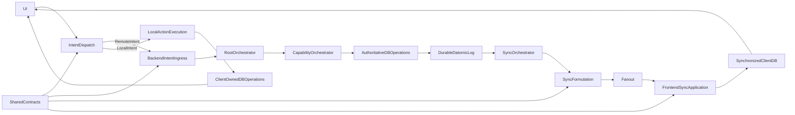

# Authoritative Backend and Synchronized Client Architecture

## Purpose

This document describes a reusable architecture for applications with:

- a server-authoritative database;
- clients that dispatch explicit remote or local intents;
- a queryable local client projection synchronized from server facts;
- a separate client-owned database for local actions when needed;
- shared data structures, protocol contracts, and context-free validation;
- server-authoritative business execution plus explicitly bounded client-local actions;
- a layered user interface whose views are the highest composition level.

It is both a structural guide and a decision framework. Project-specific concepts belong in separate product and domain documentation.

## Core principles

1. The server database is the source of truth.
2. Every user- or application-requested behavior begins as an intent and has one declared execution path.
3. Remote intents request outcomes; they do not prescribe server transactions.
4. Local intents may update client-owned data but never server-owned facts.
5. Only committed, authorized server facts enter the synchronized client projection.
6. Shared code defines data and protocol meaning, not infrastructure or command execution.
7. Synchronization is an explicit versioned protocol with ordering, recovery, and observability.
8. The synchronized client projection is disposable and reconstructable from the server.
9. Cross-database identity uses immutable logical IDs; storage-specific entity IDs never cross the synchronization boundary.
10. Lower UI layers know nothing about higher layers.
11. Large functional pieces communicate through named interfaces with explicit input and output shapes.
12. Intent type, correlation ID, and stage transitions make every behavior path traceable.
13. Correctness precedes optimistic behavior and offline mutation.
14. Every distributed operation must have a defined retry and duplication policy.
15. Orchestrators are durable state machines; side effects are explicit requests executed through interfaces.
16. Timers, transport changes, incoming synchronization, and provider callbacks are lifecycle events, not application intents.

## System structure



The two pipelines are:

```text
Backend:
intent ingress -> root orchestration -> capability/action execution
               -> database operations -> direct command response

Durable synchronization:
Datomic transaction log -> sync orchestration -> sync formulation -> fanout

Frontend:
UI -> intent dispatch -> remote or local action execution
   -> synchronized or local zone update -> UI rerender
```

Recommended top-level modules mirror those boundaries:

```text
domain/
  entities
  identifiers
  intents
  responses
  sync
  validation

backend/
  ingress
  orchestration/
    root
    capabilities
    state-machines
  actions
  db
  sync
  transport
  auth
  fanout

frontend/
  app
  intents
  lifecycle
  data/
    synchronized
    local
  sync
  ui/
    basics
    components
    composites
    features/
      overlays
    views
```

There is no separate `shell/` unit. Persistent application framing—navigation chrome, page scaffold, and route outlet—is either a composite when reusable or part of the relevant top-level view. Routing and application startup remain in `app/`. Lifecycle state machines for startup, cache hydration, synchronization, and reconnect behavior live in `lifecycle/`.

## Functional boundaries and interfaces

Directories are secondary to interfaces. Each major boundary exposes a small public namespace or protocol and keeps implementation namespaces private.

Backend boundary shapes:

- `IntentEnvelope`: decoded request plus command, correlation, caller, and protocol metadata.
- `ExecutionContext`: authenticated identity, authorization scope, clock/random providers, read interfaces, and tracing metadata.
- `ActionPlan`: logical effects, an explicit consistency policy, transaction preconditions, and safe result metadata.
- `CommitResult`: committed transaction identity, before/after basis, transaction facts, and originating IDs.
- `SyncPackage`: audience-filtered snapshot or delta.
- `DeliveryResult`: fanout acceptance/failure information.
- `WorkflowState`: durable root or capability-orchestrator state.
- `WorkflowEvent`: a fact that advances an orchestrator state machine.
- `EffectRequest`: an idempotent request for an executor or adapter.

Frontend boundary shapes:

- `UIIntent`: typed user intent with correlation metadata.
- `DispatchDecision`: declared `:remote` or `:local` route and selected handler.
- `RemoteResult`: accepted, rejected, uncertain, or transport failure.
- `LocalActionPlan`: operations restricted to the client-owned database.
- `AppliedSync`: committed client cursor and affected synchronized facts.
- `ViewProjection`: query result combining synchronized facts with client-owned state.
- `LifecycleTransition`: next lifecycle state plus requested effects.

Required interfaces:

- Backend: `IntentIngress`, `RootOrchestrator`, `CapabilityOrchestrator`, `ActionRegistry`, `ActionExecutor`, `AuthoritativeQuery`, `AuthoritativeTransact`, `EffectExecutor`, `SyncLogReader`, `SyncFormulator`, and `Fanout`.
- Frontend: `IntentDispatcher`, `RemoteIntentClient`, `LocalActionRegistry`, `LocalActionExecutor`, `LocalTransact`, `SyncReceiver`, `SyncApplier`, `ProjectionQuery`, and `LifecycleMachine`.

An intent registry is the behavior map for the system. For every intent type it declares:

- execution location (`:remote` or `:local`);
- request validator;
- action handler;
- databases it may read and write;
- expected response or local result;
- whether it produces synchronization;
- idempotency and retry policy.

No UI code chooses a transport or database directly. No action handler fans out, manipulates widgets, or bypasses its declared database interface.

Lifecycle events do not pass through the application intent registry. Timers, incoming sync packages, app resume, cache completion, provider callbacks, and connection changes are delivered to the state machine that owns that lifecycle.

## Shared domain contract

The shared `domain/` module contains portable data definitions:

- stable attribute, enum, intent, response, and error identifiers;
- entity and value-object shapes;
- request and response envelopes;
- snapshot and delta envelopes;
- protocol and schema versions;
- context-free validators;
- structured validation errors.

It must not depend on:

- a database implementation;
- HTTP, WebSocket, or another transport;
- UI frameworks or navigation;
- server lifecycle components;
- user sessions or authorization services;
- clocks, randomness, or external services.

### Validation boundary

Shared validation answers questions using only the supplied value:

- Are required fields present?
- Are values of the expected type and shape?
- Is a value in a declared enum?
- Is a number inside a request-level range?
- Is the protocol version supported?

Backend validation answers questions requiring authority or current state:

- Is the caller permitted to perform this intent?
- Do referenced entities exist and belong to the allowed scope?
- Is the request valid under the current configuration?
- Is the expected revision current?
- Are inventory, quota, or uniqueness constraints satisfied?

Passing shared validation never guarantees that the backend will accept an intent.

### Schema ownership

The shared domain owns a neutral logical attribute registry, not either database's physical schema. Each logical attribute declares portable meaning such as logical type, cardinality, identity, reference target, synchronization eligibility, and contract version.

Separate adapters derive or validate:

- the Datomic storage schema, including native scalar value types, references, uniqueness, indexes, history/full-text options, backend-only attributes, and migrations;
- the synchronized projection schema, containing only authorized synchronizable attributes and logical-reference metadata;
- the Dartascript schema, using its supported behavioral declarations for references, cardinality, uniqueness, components, and tuples;
- local-only Dartascript schemas for navigation, device settings, command lifecycle, and other client-owned facts.

DataScript-style databases are schemaless for ordinary scalar values and require schema only when it changes database behavior. Datomic requires richer physical schema for durable storage and indexing. Therefore the Datomic schema must not be sent directly to the client, and the Dartascript schema must not be treated as a sufficient Datomic schema.

Logical UUIDs use one canonical wire representation, initially lowercase hyphenated UUID strings. The Datomic adapter may convert them to native UUID values; Dartascript may retain canonical strings. Contract tests prove that both physical schemas implement the same logical identity, cardinality, and reference semantics.

## Backend intent processing

An intent describes the user's goal, not a database mutation.

A request envelope should include:

```clojure
{:protocol/version 1
 :command/id        #uuid "..."
 :correlation/id    #uuid "..."
 :causation/id      optional-parent-id
 :intent/type       :namespace/action
 :intent/payload    {...}
 :client/time       optional-display-only-time}
```

A synchronization cursor is not a general command precondition. An intent that requires stale-write protection declares an explicit expected revision, expected value, or basis in its payload and consistency policy.

Intent ingress performs protocol-facing work and produces either a rejected request or an `IntentEnvelope` plus `ExecutionContext`:

1. Decode the envelope.
2. Validate its shared shape.
3. Authenticate the caller.
4. Resolve authorization scope.
5. Check command idempotency.
6. Resolve the root workflow and action through their registries.

The root orchestrator then:

1. Selects the next capability or action.
2. Dispatches it with workflow, step, correlation, causation, and idempotency identifiers.
3. For a multi-step or waiting workflow, creates or restores durable state and persists waiting, completion, retry, timeout, cancellation, and failure transitions.
4. For a simple command, proceeds directly to its action and atomic transaction without manufacturing an unnecessary long-running workflow record.

A capability orchestrator may coordinate multiple asynchronous steps. A simple action handler reads through `AuthoritativeQuery`, applies contextual rules, and returns an `ActionPlan`; it does not transact or fan out.

Database operations then:

1. Validate the plan and its declared consistency policy.
2. Convert logical effects and preconditions into storage-specific operations.
3. Recheck state-sensitive invariants at transaction time.
4. Commit domain facts, command ID, canonical payload hash, and command result in one atomic authoritative transaction.
5. Return a `CommitResult`.

The command transport returns accepted or rejected directly from the committed result. Fanout does not deliver command acknowledgements.

Synchronization is not an in-memory continuation of the command request. A separate sync orchestrator reads committed transactions from the durable database log, checkpoints its progress, formulates audience-specific packages, and hands those packages to fanout.

Clients should not send raw transaction data. This keeps persistence layout, authorization, and invariants under server control.

Every stage preserves `command/id`, `correlation/id`, and, when one operation causes another, `causation/id`. These identifiers must appear in structured logs and safe transaction/sync metadata so one behavior can be followed end to end.

### Action consistency policies

Every state-dependent `ActionPlan` declares one supported policy:

- `:last-write-wins`: a later accepted write replaces the earlier value.
- `:compare-and-swap`: named old values must still match.
- `:expected-revision`: an entity or aggregate revision must still match.
- `:transaction-function`: validation and calculation execute against the transaction-time database value.
- `:commutative`: the effect is expressed as an operation that safely composes with concurrent operations.
- `:append-only`: the action adds immutable facts without replacing prior facts.

The authoritative transaction adapter enforces the selected policy and rejects unknown or weakened policies. An action plan records logical effects and preconditions; it must not rely on a stale precomputed replacement when concurrent changes would invalidate the decision.

## Durable orchestration

Orchestration is hierarchical and organized around workflows rather than external services.

### Root workflow orchestrator

The root orchestrator owns the end-to-end workflow state machine. It chooses the next capability, dispatches work, checkpoints progress, waits for lifecycle events, and applies retry, timeout, cancellation, failure, and compensation policy. It knows capability contracts but not provider or database implementation details.

### Capability orchestrators

A capability orchestrator owns a bounded, potentially asynchronous state machine such as analysis, synchronization, notification delivery, file processing, external-provider integration, or a long-running database job. A normal atomic database transaction uses an executor rather than a durable sub-orchestrator; migrations, imports, batches, and multi-stage database work may justify one.

### Executors and adapters

Executors perform individual side effects such as submitting an external request, executing a transaction, sending a package, reading a file, or scheduling a timer. They do not own workflow policy.

Parent and child orchestrators communicate through explicit contracts:

```clojure
{:workflow/id      #uuid "..."
 :step/id          #uuid "..."
 :capability       :namespace/capability
 :operation        :start
 :input            {...}
 :idempotency/key  stable-key
 :correlation/id   #uuid "..."
 :causation/id     parent-event-id}
```

Children return lifecycle events:

```clojure
{:workflow/id    #uuid "..."
 :step/id        #uuid "..."
 :event/type     :step/completed
 :result         {...}
 :correlation/id #uuid "..."
 :causation/id   effect-request-id}
```

State transitions are pure:

```clojure
(transition current-state event)
;; => {:state next-state
;;     :effects [effect-request ...]}
```

When a transition requests an external effect, the orchestrator persists its next state and an outgoing effect request atomically before execution. Workers execute effects at least once and report results as lifecycle events, so every effect requires an idempotency policy. A workflow may span the entire logical input-to-output process without requiring one process, thread, or call stack to remain alive.

Ingress and egress describe adapter direction, not separate orchestrator types. HTTP requests, schedules, and provider callbacks are ingress adapters; external APIs, storage, and delivery mechanisms are egress adapters. Workflow policy remains in the owning orchestrator.

## Synchronization protocol

### Required invariants

The protocol must preserve these properties:

- Ordered: deltas are applied in server order within a synchronization scope.
- Gap-detectable: the client can recognize a missing predecessor.
- Idempotent: replaying an already applied delta has no effect.
- Recoverable: the client can request replay or replace local state with a snapshot.
- Authorized: every snapshot and delta contains only facts visible to that audience.
- Complete: additions, changes, retractions, and entity removal are representable.
- Correlatable: the originating client can connect an acknowledgement and resulting delta to its command.
- Versioned: incompatible schema or protocol changes are detected before application.
- Atomic: a client never exposes half of one authoritative transaction.
- Reconstructable: a fresh snapshot represents the same authorized state as replaying accepted deltas to the same cursor.
- Durable: every committed transaction remains discoverable through the authoritative transaction log even if backend processes crash.
- Logically identified: synchronized subjects and references use application-level IDs, never Datomic or client-database entity IDs.

### Snapshot envelope

An initial or recovery snapshot should contain:

```clojure
{:protocol/version 1
 :schema/version   1
 :sync/scope       stable-scope-id
 :sync/current-through datomic-t
 :projection/schema {...}
 :projection/datoms [...]
 :snapshot/checksum optional-checksum}
```

The snapshot datoms and `current-through` value must come from the same consistent database basis. The client builds a new local projection away from the live connection, validates it, then swaps it into use atomically. It should not clear the current projection before the replacement is ready.

### Delta envelope

An incremental update should contain:

```clojure
{:protocol/version 1
 :schema/version   1
 :sync/scope       stable-scope-id
 :sync/from-t       previously-applied-datomic-t
 :sync/current-through ending-datomic-t
 :transaction/ids  [stable-transaction-id ...]
 :command/ids      [originating-command-id ...]
 :projection/adds  [...]
 :projection/retracts [...]
 :transaction/meta safe-client-metadata}
```

The client applies a delta only when:

- protocol and schema versions are supported;
- the scope matches the local projection;
- `sync/from-t` equals the locally stored `applied-through`;
- none of the projected transaction identities conflict with already applied data.

The datoms and `applied-through` advance must be committed to the local projection as one operation.

### Cursor rules

A synchronization cursor is Datomic transaction `t`, carried with a synchronization scope. It means that every transaction through that `t` has been considered for that scope—not that every transaction produced client-visible facts.

An invisible transaction is one that changes no facts visible in the current authorization/projection scope. A range package covering `(from-t, current-through]` certifies that it contains every visible addition and retraction in that range, so its cursor may jump across invisible transactions.

A cursor valid for one user, tenant, workspace, authorization version, or projection filter is not valid for another. Changing authorization or projection filters rotates the scope and requires explicit reauthorization; when complete incremental correction cannot be proven, it requires a new snapshot.

The durable Datomic transaction log is the source of committed synchronization work. Sync consumers checkpoint the latest transaction they have safely processed and can resume after restart. Fanout failure cannot erase committed synchronization work.

### Deterministic package regeneration

The initial synchronization design does not require a durable per-client package journal. Missing range packages are regenerated from retained Datomic history using:

- the requested `from-t` and target `current-through`;
- an immutable synchronization-scope descriptor;
- the authorization epoch;
- the projection-contract and projection-schema versions;
- the deterministic logical-ID and projection rules active for those versions.

The sync consumer checkpoint represents ingestion/formulation progress, never successful client delivery. Live fanout is retryable but not the source of correctness; a client that detects it is behind requests deterministic regeneration from its own `applied-through`.

Regeneration is supported only while the required Datomic history, scope, authorization epoch, and projection implementation remain compatible. If any prerequisite is unavailable—or regeneration would exceed configured cost/size limits—the server returns `resync-required` and issues a fresh basis-consistent snapshot. Package caches may be added as performance optimizations but never become the source of truth.

Projection and canonicalization code used for regeneration is versioned and deterministic at the logical-fact level. Wire compression or framing may vary without changing the package's logical meaning.

### Synchronization status

The server periodically sends an authenticated status message:

```clojure
{:message/type         :sync/status
 :sync/scope           stable-scope-id
 :sync/current-through safely-processed-datomic-t}
```

`current-through` is the transaction through which synchronization processing is known complete for that scope. It may trail the newest database transaction while the sync orchestrator is working.

The client stores `:sync/applied-through`. Equal values mean current; a client behind requests replay; a client ahead indicates corruption or a mismatched scope; a scope mismatch requires reauthorization and normally a fresh snapshot. This message also serves as application-level liveness detection. Failure to receive it within the configured timeout triggers reconnect.

### Reconnect algorithm

On reconnect:

1. Client presents its scope, `applied-through`, supported protocol version, and schema version.
2. Server verifies that the scope and authorization remain valid.
3. If all missing deltas are retained and compatible, replay them in order.
4. Otherwise, return `resync-required` and issue a fresh snapshot.
5. Client atomically replaces its projection and resumes from the snapshot's `current-through`.

App resume performs the same status comparison immediately rather than waiting for the periodic message. Live packages received while replay or snapshot replacement is in progress are buffered by connection generation or discarded and requested again from the newly activated cursor.

Replay retention is an operational policy, not a correctness requirement; snapshot recovery must always remain available.

### Duplicates, gaps, and out-of-order delivery

- Exact duplicate range and transaction identities: acknowledge and ignore.
- Conflicting transaction identity, overlapping range with different contents, or unknown `from-t`: stop applying deltas and request recovery.
- Delta for another scope: reject it.
- Unsupported version: stop synchronization and require upgrade or migration.
- Malformed delta: preserve the current projection, record diagnostics, and request recovery.
- Connection loss after command acknowledgement: reconnect using the client's `applied-through`; never infer that projection state is current from the acknowledgement alone.

### Command idempotency

Every mutating intent receives a client-generated `command/id`.

The idempotency key is scoped by the authoritative principal/account and command ID. The server commits the command ID, canonical payload hash, domain mutation, and reusable result atomically in Datomic. Concurrent delivery of the same key resolves to one committed result. Reusing an ID with a different canonical payload is an error. Idempotency retention must exceed the expected retry window; behavior after expiry must be explicit and must not silently promise exactly-once execution.

The command transport—not fanout—returns the direct accepted or rejected response. An accepted command and a committed transaction are distinct from a client observing the resulting delta. A sync package carries the originating command ID when applicable so the client can correlate acceptance with synchronized state. The UI may show:

- pending: command sent, no acknowledgement;
- accepted: authoritative transaction committed, delta not yet observed;
- synchronized: corresponding cursor applied locally;
- rejected: structured failure received;
- uncertain: connection failed before acceptance status was learned.

### Authorization and filtered projections

Never construct a global delta and rely on clients to discard unauthorized facts.

Define the authorized projection as a function:

```text
P(database-basis, synchronization-scope) -> logically identified facts
```

A correct filtered delta represents the difference between the authorized projections at its range boundaries:

```text
P(after-basis, scope) − P(before-basis, scope)
```

Filtering only the datoms present in the triggering transaction is insufficient. A membership or visibility change can make an existing graph visible or invisible even though that graph's historical datoms are absent from the current transaction.

Each projection contract identifies its visibility-affecting attributes and required referential closure. For ordinary transactions that cannot alter visibility, formulation may use an equivalent incremental algorithm. When a visibility-changing transaction cannot be proven incrementally complete, rotate the scope and issue a basis-consistent snapshot rather than risk incomplete grants or revocations.

Projection occurs under an explicit audience or synchronization scope. When a transaction changes visibility:

- newly visible facts are added;
- no-longer-visible facts are retracted;
- dependent references are either included, replaced with safe identifiers, or omitted according to the projection contract.

Authorization changes invalidate the prior scope unless the protocol can prove complete visibility correction. The server terminates or reauthorizes active streams, rotates the scope, rechecks authorization before replay, and emits complete retractions or requires a fresh snapshot. Clients purge synchronized data on logout/account removal and do not retain an old authorized projection under a new principal.

### Identity

Every synchronized entity has an immutable application-level logical ID, normally a UUID stored in a unique identity attribute such as `:entity/id` or a type-specific equivalent. Logical IDs are never reused.

The authoritative Datomic schema should define the logical ID as a unique identity attribute:

```clojure
{:db/ident       :entity/id
 :db/valueType   :db.type/uuid
 :db/cardinality :db.cardinality/one
 :db/unique      :db.unique/identity}
```

The unique identity is available through AVET-backed lookup refs such as `[:entity/id logical-uuid]`. After boundary resolution, queries and transactions continue using Datomic's internal entity IDs and native EAVT/AEVT/AVET/VAET indexes.

Relationships must be stored as native database references, not UUID scalar attributes. Datomic transaction input may identify a target with a logical lookup ref, but Datomic stores the resolved entity reference internally. The client database follows the same pattern: `:entity/id` is a unique identity, reference attributes use the database's native reference type, and logical IDs are resolved/upserted into client-local entity IDs during sync application.

This convention preserves native pull, joins, reverse references, and index performance. Its expected overhead is one indexed UUID identity per synchronized entity, boundary lookup resolution, and larger wire values than integer entity IDs. Large snapshot/import application should batch identities, use lookup refs/upserts, or derive a temporary logical-ID-to-local-eid map from AVET rather than performing repeated unindexed scans.

Datomic entity IDs and client-database entity IDs are local implementation details. They must not appear as synchronized subjects, reference values, intent identifiers, response identifiers, URLs, persisted cross-database mappings, or external API identities. Datomic transaction `t` remains valid as a synchronization cursor because it represents log position, not entity identity.

The sync formulator converts:

- each Datomic entity subject into its logical ID;
- each reference-typed value into the referenced entity's logical ID;
- additions and retractions into logical facts whose identity is independent of either database's internal entity allocation.

The synchronized schema identifies reference attributes so the client can resolve or upsert logical references into its own local entity IDs. Snapshot replacement may allocate entirely different client entity IDs without changing observable identity or relationships.

References included in a projection must either resolve to another visible logical entity, use an explicitly safe external logical identifier, or be omitted according to the projection contract. Raw entity IDs must never be used as placeholders for unauthorized or unavailable references.

Temporary client IDs are allowed only inside a command that creates new entities. The authoritative transaction assigns stable logical IDs and returns the temporary-to-logical mapping in the direct result or resulting sync package. Subsequent commands use only the logical ID.

Logical identity attributes of synchronized entities are immutable: they are never changed, retracted, reused, or excised. Deletion is represented by a tombstone such as `:entity/deleted? true` plus any appropriate domain-fact retractions while retaining the logical identity needed for replay, reference cleanup, and audit. Hard physical cleanup, if ever introduced, must preserve a durable identity ledger and occur only under an explicit retention protocol.

Retraction formulation resolves subjects and reference values against the transaction's before/after bases or the durable identity ledger. The client never creates/upserts an entity while applying a retraction.

Import and migration code must backfill and validate logical IDs before data becomes synchronizable. Duplicate, missing, mutable, retracted, excised, or reused logical IDs are synchronization errors.

### Schema evolution

Maintain separate versions for:

- intent/response protocol;
- synchronized projection schema;
- server storage schema.

Compatible additions may retain a major version. Renames, removals, type changes, cardinality changes, and identity changes require a migration or fresh snapshot.

Deploy in an order that keeps at least one compatible overlap:

1. Server accepts old and new contracts.
2. New clients deploy.
3. Old contract usage drains.
4. Server removes old support.

Local projection migrations are optional. If rebuilding from a snapshot is safe and affordable, prefer rebuilding over complex client migrations.

## Frontend data ownership

The frontend has two explicit ownership zones in one physical Dartascript database:

- The synchronized cache stores authoritative facts received from the server plus its scope and `applied-through` cursor. Only `SyncApplier` writes it.
- The local zone stores client-owned facts created by local actions. Only `LocalTransact` writes it.

The synchronized and local zones use disjoint namespaces, separate transaction APIs, separate schema/version metadata, and separate persistence envelopes within the same database. Only synchronized facts are replaced during snapshot recovery; local facts are preserved unless an explicit account/device reset policy removes them. Cross-zone references use logical IDs rather than shared entity-ID assumptions.

Both may be persisted between application sessions, but they have different semantics:

- Synchronized cache: load immediately at startup, mark potentially stale, then compare sync status and replay or resnapshot. It remains disposable and reconstructable.
- Device settings: persist locally for device-specific preferences such as theme, layout, and device behavior.
- Account settings: persist authoritatively on the server and synchronize so they follow the account across devices.

When one preference has device and account values, precedence is device override, then account default, then application default unless a product explicitly chooses otherwise.

Every persisted local record is scoped to the device, principal/account, and relevant synchronization scope. Logout, account removal, account switching, authorization loss, and synchronized-entity removal have explicit purge or reconciliation policies. Sensitive caches use platform-appropriate protected storage or encryption.

The following normally belong to the local zone or ephemeral view state, never to the synchronized ownership zone:

- route and navigation state;
- form drafts;
- pending command state;
- search, filter, sort, and pagination state;
- transient dialogs and selections;
- cached presentation artifacts.

Views use `ProjectionQuery` to combine synchronized facts, local facts, and ephemeral state from the two ownership zones. Database listeners invalidate queries or trigger reactive rebuilding; database and synchronization code never manipulate widgets directly.

### Frontend intent pipeline

1. UI creates a `UIIntent`; it does not call a backend, action handler, or database.
2. `IntentDispatcher` validates and looks up the intent registry.
3. Remote intents go through `RemoteIntentClient` to backend intent ingress.
4. Local intents go through `LocalActionExecutor`, which returns a `LocalActionPlan`.
5. `LocalTransact` applies local plans only to the client-owned database.
6. Backend fanout reaches `SyncReceiver`; `SyncApplier` validates and applies it only to the synchronized zone.
7. Projection listeners rerun view queries and the UI rerenders.

A remote acknowledgement does not write synchronized facts. The corresponding sync package is the only normal path by which a remote action changes the synchronized zone.

Remote command lifecycle state is owned by a dedicated local controller/store:

```text
created -> pending -> accepted -> synchronized
                   -> rejected
                   -> uncertain
```

A sync package may arrive before the direct response and move the command directly to `synchronized`. A successful no-op or command with no visible projection change terminates at an explicit completed state supplied by its direct result.

Start without optimistic authoritative writes. If optimistic behavior is later justified:

- keep speculative facts separate from synchronized facts;
- associate them with a command ID;
- define rollback and reconciliation;
- test rejection, reordering, and reconnect behavior;
- never advance the authoritative cursor for speculative state.

## Lifecycle state machines

Lifecycle state machines coordinate execution facts rather than desired application behavior. They consume events, perform pure transitions, and request effects through interfaces.

The client synchronization lifecycle uses states such as:

```text
uninitialized
-> loading-cache
-> connecting
-> replaying | snapshotting
-> synchronized
-> reconnecting | recovery-required | authentication-required
```

Its events include app start/resume, cache loaded, connection opened/lost, sync status received, snapshot received, delta received, gap detected, authorization revoked, timeout, and protocol incompatibility.

Long-running backend workflows use durable states such as:

```text
queued
-> running
-> waiting-for-capability
-> retry-scheduled
-> succeeded | failed | cancelled
```

Transition functions return next state and effect requests. Effect runners perform networking, storage, timers, and provider calls, then return outcomes as lifecycle events. Client connection state may be ephemeral while its cursor is durable; backend workflow state is persisted so it survives process restarts.

Invalid, duplicate, stale-generation, and out-of-order events have explicit behavior. State-machine tests enumerate valid transitions and generate failure sequences without requiring real transports or providers.

## Frontend UI hierarchy

Import dependencies point from higher composition layers to lower layers:

```text
views -> features -> composites -> components -> basics
```

- Basics are indivisible styled controls and display primitives.
- Components combine a small number of basics into reusable controls.
- Composites are substantial reusable sections with configurable content.
- Features are cohesive stateful capabilities that may query the projection or submit intents but do not own routes.
- Views are route-level compositions and the highest UI layer.

Views live inside `ui/views/`. Overlays live inside `ui/features/overlays/` because they are stateful interaction capabilities rather than a separate architectural layer. Application framing is a composite or view composition, not a `shell` module. A layer may import lower layers, including skipping a level when appropriate; lower layers never import higher layers, and peer imports must not create cycles. Place code according to responsibility and observed reuse.

## Backend organization

- `ingress/`: intent decoding, shared validation, authentication coordination, idempotency lookup, and action resolution.
- `orchestration/`: durable root and capability state machines, workflow checkpoints, effect requests, retries, cancellation, and compensation.
- `actions/`: action registry, executors, contextual validation, business rules, and `ActionPlan` construction.
- `db/`: authoritative query and transaction interfaces plus schema, migrations, and storage adapters.
- `sync/`: durable-log consumption, snapshots, committed-transaction projection, audience filtering, range cursors, status, and replay.
- `fanout/`: delivery policy and connection/subscriber targeting.
- `transport/`: HTTP/WebSocket decoding and encoding.
- `auth/`: authentication, authorization, and synchronization-scope resolution.

Root orchestrators sequence workflows but do not implement capability internals. Capability orchestrators own bounded state machines; executors perform effects. Action executors depend on explicit query capabilities and return plans; they do not call transport, fanout, or widgets. Database adapters do not formulate sync packages. Sync formulation consumes durable committed transactions from the Datomic log, not an uncommitted plan, and does not deliver packages itself. Fanout delivers already formulated sync packages and does not deliver command acknowledgements or reinterpret domain facts.

## Dependency direction

Dependencies point inward toward contracts and interfaces:

```text
transport -> ingress -> root orchestrator
root orchestrator -> capability orchestrator/action interfaces
capability orchestrators -> executor + db interfaces
db adapters -> db interfaces
Datomic log adapter -> sync orchestrator
sync orchestrator -> sync formulation
sync formulation -> committed-transaction + authorization interfaces
fanout adapters -> fanout interface

views -> features -> composites -> components -> basics
views/features -> intent dispatcher + projection query interfaces
remote/local/sync adapters -> their interfaces
lifecycle effect runners -> lifecycle machine interfaces
```

Composition roots in `backend/system` and `frontend/app` are the only places that assemble concrete implementations. Cross-boundary calls in tests can therefore use fakes without loading the full system.

## Testing strategy

### Shared contracts

- Run identical fixtures on every target runtime.
- Verify accepted and rejected shapes produce equivalent structured results.
- Test protocol-version negotiation and unknown enum handling.

### Backend

- Test authorization and contextual validation independently.
- Test command idempotency and payload mismatch.
- Contract-test every implementation of orchestration, query, transaction, durable-log, sync-formulation, effect-execution, and fanout interfaces.
- Verify action executors return plans without performing database or delivery side effects.
- Verify every action consistency policy is enforced at transaction time under concurrent changes.
- Verify workflow state and outgoing effect requests survive process restart and duplicate delivery.
- Test each command's authoritative transaction.
- Test projection filtering for multiple audiences.
- Test transaction-to-delta conversion, including retractions and visibility changes.
- Test grants and revocations over pre-existing graphs; compare each emitted result with `P(after, scope) − P(before, scope)`.
- Test that sync packages contain no Datomic entity IDs, including reference values and retractions.
- Load equivalent snapshots into client databases with different internal entity allocations and verify identical logical queries and relationships.
- Verify tombstone deletion retains logical identity and that retractions resolve from before/after bases without ghost upserts.
- Reject missing, duplicate, mutated, retracted, excised, or reused logical IDs during import and sync formulation.
- Test schema and protocol compatibility paths.

### Client synchronization

- Apply a snapshot and compare its projection with expected facts.
- Verify snapshot facts and `current-through` come from the same database basis.
- Apply ordered deltas and compare with a fresh snapshot at the same cursor.
- Apply packages whose ranges cross invisible transactions.
- Replay duplicate deltas.
- Deliver deltas out of order and with gaps.
- Interrupt snapshot replacement before activation.
- Reconnect inside and outside replay retention.
- Change authorization scope.
- Miss the final delta and recover after a later sync status message.
- Compare status immediately on app resume and reconnect.
- Exercise malformed payloads and unsupported versions.

### End-to-end

For each remote vertical slice:

1. Submit an intent.
2. Resolve and execute the registered action.
3. Commit an authoritative transaction.
4. Restart the sync consumer if the scenario tests crash recovery.
5. Read the committed transaction from the durable log.
6. Formulate an authorized range delta.
7. Deliver it through the real transport codec.
8. Apply it to the synchronized zone.
9. Assert that the view-facing query returns the expected result.

For each local vertical slice:

1. Submit an intent through the same UI-facing dispatcher.
2. Verify it resolves only to a registered local action.
3. Execute and apply a local action plan.
4. Assert that synchronized facts and cursor are unchanged.
5. Assert that the view-facing query returns the expected combined result.

Property-based and state-machine tests are especially valuable for synchronization because they can generate duplicates, gaps, reorderings, reconnects, and authorization changes.

Orchestrator tests start from persisted state and an event, then assert the next state and requested effects. They cover duplicate events, retries, timeouts, cancellation, stale generations, restart recovery, and parent/child correlation.

## Observability

Record structured events using safe identifiers:

- command ID, correlation ID, causation ID, intent type, execution location, caller, and outcome;
- workflow ID, step ID, orchestrator state, attempt, requested effect, and lifecycle-event transitions;
- ingress, action, database, durable-log, sync-formulation, fanout, client-apply, and rerender stage transitions;
- authoritative transaction ID;
- synchronization scope, range, `current-through`, and client `applied-through`;
- snapshot size and construction duration;
- delta size, delivery attempts, and apply latency;
- replay count and resync reason;
- client protocol/schema versions;
- projection checksum mismatch.

Do not log sensitive datom values indiscriminately. Correlation must be possible from command receipt through transaction, fanout, and client application.

## Decision rules

When adding shared code, ask:

1. Do both runtimes need to interpret this exact data or validation rule?
2. Can it remain independent of storage, transport, UI, time, and randomness?
3. Will sharing it reduce semantic drift rather than merely move code?

When adding client-side behavior, ask:

1. Is this authoritative fact or ephemeral presentation state?
2. Must it survive rebuilding the local projection?
3. Is the intent explicitly registered as remote or local?
4. Which database is its handler allowed to write?
5. What happens if the command is rejected, duplicated, or acknowledged without its delta being observed?

When adding orchestration, ask:

1. Which workflow owns this state transition?
2. Is this a root workflow, bounded capability workflow, simple action, or individual effect?
3. What state must survive restart?
4. Are state transition and outgoing effect request persisted atomically?
5. What is the idempotency policy for duplicate effects and events?
6. Is an external callback a lifecycle event rather than a new application intent?

When changing synchronization, ask:

1. How are ordering and gaps detected?
2. Is replay idempotent?
3. How are retractions and visibility changes represented?
4. Can a fresh snapshot recover every failure?
5. Are protocol, projection, and storage versions independently managed?
6. Can tests prove replayed state equals fresh-snapshot state?
7. Do ranges certify every visible change through `current-through`, including invisible transactions?
8. Can a status comparison detect a missed final package?
9. Are every synchronized subject and reference represented by logical ID rather than a storage entity ID?

## Initial implementation constraints

Prefer the simplest correct version:

- online-only mutations;
- server-authoritative command execution;
- durable root/capability orchestration only where workflow state must survive waits or restarts;
- simple executors for one-step effects and ordinary atomic transactions;
- explicitly registered local actions for client-owned state;
- separate synchronized and local write interfaces;
- no optimistic writes to synchronized facts;
- one clearly defined synchronization scope per connection;
- snapshot bootstrap plus Datomic-`t` range deltas;
- periodic `sync/status` messages with `current-through`;
- direct command responses and sync-only fanout;
- atomic command idempotency records with domain mutations;
- durable Datomic-log-driven synchronization;
- full resnapshot as the universal recovery path;
- explicit protocol and projection schema versions;
- stable application-level IDs.
- no storage-specific entity IDs in intents, APIs, URLs, snapshots, or deltas.

Offline commands, speculative writes, multi-device conflict resolution, and partial local migrations should be added only after concrete requirements justify their complexity.

## Architecture change process

Record decisions that alter source-of-truth ownership, synchronization invariants, shared-module boundaries, identity, schema evolution, or UI dependency direction.

Each decision should state:

- the problem and constraints;
- the chosen option;
- rejected alternatives;
- consequences and failure modes;
- required tests and migration steps.

Architecture is allowed to evolve, but invariants must change deliberately rather than emerging from implementation accidents.
