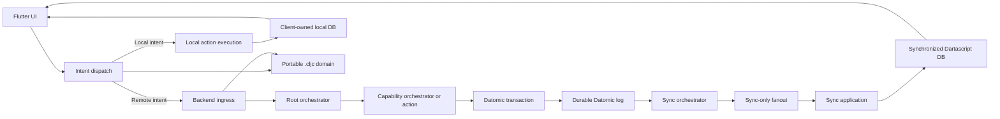

# SMERF ClojureDart Rebuild Plan

Rebuild SMERF as a ClojureDart/Flutter client backed by Dartascript, with a Clojure/JVM/Datomic authoritative backend, durable hierarchical orchestration, Datomic-log-driven synchronization, and a portable `.cljc` contract library. Preserve all meaningful entity and organism behavior while enforcing explicit interfaces between intents, workflows, effects, persistence, sync, local state, and UI.

## Target architecture

Use a monorepo with three top-level modules:

- [`ARCHITECTURE.md`](../../ARCHITECTURE.md): reusable architecture principles, synchronization invariants, module boundaries, failure handling, testing strategy, and decision rules. Project-specific plans must conform to it or record an explicit architecture decision.
- `domain/`: portable `.cljc` data definitions compiled by both `:clj` and `:cljd`. It owns stable attribute and intent keywords, entity structure definitions, enums, request/response/sync shapes, schema versions, and context-free validation. It does not execute commands or perform database operations.
- `backend/`: Clojure/JVM service with Datomic as the source of truth. The command pipeline is intent ingress -> root orchestration -> capability/action execution -> atomic database operation -> direct response. The independently recoverable sync pipeline is durable Datomic log -> sync orchestration -> range formulation -> sync-only fanout.
- `frontend/`: ClojureDart/Flutter app with one persisted Dartascript database containing separate synchronized-cache and client-owned-device-data zones. Its pipeline is UI -> intent dispatch -> remote or local execution -> synchronized or local zone update -> UI rerender; infrastructure lifecycle events use state machines rather than the intent registry.

Share definitions, not command execution. Every synchronized entity and reference uses an immutable logical ID, normally a UUID identity attribute. Datomic and Dartascript entity IDs remain private implementation details and never appear in intents, responses, URLs, snapshots, deltas, or cross-database mappings. Keep contracts explicit and versioned. The backend may reject a structurally valid request because authorization or current database state fails a contextual rule.

Logical identity does not replace native database references:

- Define `:entity/id` as a UUID, cardinality-one, unique-identity attribute so logical lookup refs use AVET.
- Resolve logical IDs at ingress/sync boundaries, then use each database's internal entity IDs and normal indexes internally.
- Store relationships as native Datomic/Dartascript reference attributes; never store UUID scalar values merely to avoid entity IDs.
- During sync, translate subjects and reference values to logical IDs, then resolve/upsert them into Dartascript-local entity IDs.
- Batch large snapshot/import resolution through lookup refs/upserts or a temporary AVET-derived map; never repeatedly scan for logical IDs.

A neutral logical attribute registry is the schema source of truth. It declares portable type, cardinality, identity, reference target, synchronization eligibility, and contract version. Separate adapters derive/validate the richer Datomic storage schema, synchronized projection schema, Dartascript behavioral schema, and local-only Dartascript schemas. Canonical wire UUIDs are lowercase hyphenated strings; Datomic may convert them to native UUIDs while Dartascript retains strings.

## Proposed project shape

- `domain/src/smerf/domain/`
  - `entities.cljc`: entity and attribute definitions for campaigns, worlds, rulesets, characters, resources, actions, and rolls
  - `identifiers.cljc`: logical-ID conventions, stable keywords, enum values, and protocol versions
  - `intents.cljc`: request shapes such as update wounds, add inventory, and roll dice
  - `responses.cljc`: acknowledgements and typed errors
  - `sync.cljc`: basis-consistent snapshot, Datomic-`t` range delta, `sync/status`, scope, and resync-required shapes
  - `workflows.cljc`: workflow/step/event/effect-request structures and state-machine result shapes
  - `validation.cljc`: portable shape/type/range validation and human-readable validation errors
- `backend/src/smerf/backend/`
  - `ingress/` for decoding, shared validation, authentication coordination, idempotency, and action resolution
  - `orchestration/` for durable root/capability state machines, checkpoints, effect requests, retries, cancellation, and compensation
  - `actions/` for the action registry, contextual rules, logical effects, consistency policies, and action-plan construction
  - `db/` for Datomic query/transaction interfaces, adapters, schema, and migrations
  - `sync/` for durable-log consumption, consistent snapshots, range deltas, audience filtering, `current-through` status, replay, and resnapshot
  - `fanout/` for sync-package delivery policy and connection/subscriber targeting, never command acknowledgements
  - `transport/`, `auth/`, and the `system.clj` composition root
- `frontend/src/smerf/frontend/`
  - `app/` for startup, theme, dependency wiring, inbound URL/deep-link adaptation, and the database-driven view host
  - `intents/` for the intent registry, dispatcher, remote client, and local action execution
  - `lifecycle/` for startup, cache hydration, synchronization, reconnect, command-lifecycle, and app-resume state machines
  - `data/synchronized/` for the persisted server-owned Dartascript zone, scope, `applied-through`, and read/write interfaces
  - `data/local/` for persisted navigation state, device settings, other client-owned data, and their read/write interfaces within the same database
  - `sync/` for snapshot/range/status receipt, validation, atomic application, replay, and recovery
  - `ui/basics/` for indivisible styled controls and display primitives
  - `ui/components/` for small reusable combinations of basics
  - `ui/composites/` for substantial reusable sections composed from components
  - `ui/features/` for cohesive stateful capabilities, including `ui/features/overlays/`
  - `ui/views/{campaigns,worlds,rulesets,characters,resources,actions}/` for route-level screens
- `test/` trees mirror each module; shared domain tests execute on both JVM and ClojureDart.

Each large functional piece exposes a small public interface and keeps implementations private. Backend boundary values are `IntentEnvelope`, `ExecutionContext`, `WorkflowState`, `WorkflowEvent`, `EffectRequest`, `ActionPlan`, `CommitResult`, `SyncPackage`, and `DeliveryResult`. Frontend boundary values are `UIIntent`, `DispatchDecision`, `RemoteResult`, `LocalActionPlan`, `AppliedSync`, `LifecycleTransition`, and `ViewProjection`. Every requested behavior preserves intent type, command ID, correlation ID, and causation ID; lifecycle events preserve workflow/step identities and state transitions.

## Shared data structures and ownership

- Campaign: title, owner/members, world IDs, ruleset IDs, character IDs, available resource IDs, default ruleset ID, and active play ruleset ID. “Active campaign” is client session state, not persisted on the campaign record.
- World: rename the UI concept “realm” to world while retaining nested world entries for realms, territories, races, locations, and other lore nodes. Store a typed tree/graph with title and markdown details. Keep parent/child traversal pure.
- Ruleset: stat granularity, wound tiers, modifier bounds, splinter/combination rules, encounter/damage options, experience progression, and markdown reference sections. Domains belong to ruleset configuration or a campaign ruleset binding, not implicitly to navigation state.
- Character: identity, portrait, description, ancestry/race, experience, notes, domain/stat values, wounds, owned resource instances, and action IDs. Normalize the current `:title` versus `:creature/name` mismatch to `:character/name`.
- Resource definition: world/catalog content such as equipment, traits, expertise, affiliations, and items, with properties, flavor text, quality/power descriptors, and action links.
- Character resource: an owned resource instance with character ID, resource definition ID, quantity, and future per-instance state.
- Action: reusable roll definition with selected domains/stats, resource modifiers, flat/dice modifiers, splinters, combinations, and target number.
- Roll intent: action ID and user-selected inputs. Roll result: server-calculated pools, generated dice, outcome metadata, algorithm version, and optional reproducibility seed.
- Resource/ruleset seam: represent `ResourceDefinition` as world-facing facts and reserve a versioned `ResourceUsage` data shape for ruleset interpretation. The backend owns resolution and validation; the first rebuild preserves existing quality/power behavior without designing the final cross-system resource language.

Shared validation covers facts that require no database access: required keys, value types, enum membership, non-negative quantities, syntactic IDs, modifier ranges encoded directly in a request, and protocol versions. Backend-only validation covers authorization, entity existence, campaign membership, current ruleset constraints, stale revisions, inventory availability, and any rule requiring a Datomic query.

## Orchestration and action consistency

- A root orchestrator owns each end-to-end multi-step workflow, checkpoints durable state, dispatches bounded capabilities, and applies retry, timeout, cancellation, failure, and compensation policy.
- Capability orchestrators own substantial asynchronous state machines such as future LLM analysis, synchronization, notification delivery, file processing, or long-running imports. Ordinary one-step effects and atomic Datomic transactions use executors rather than unnecessary durable sub-orchestrators.
- State transitions are pure `(state, event) -> {next-state, effect-requests}`. When a transition requests an external effect, persist the next state and effect request atomically before at-least-once execution.
- Ingress/egress describe adapter direction; workflows—not external services—own orchestration policy.
- Every state-dependent `ActionPlan` selects one enforced policy: last-write-wins, compare-and-swap, expected revision, transaction function, commutative operation, or append-only. The Datomic adapter rechecks preconditions at transaction time and rejects unknown or weakened policies.

## Backend responsibilities and API slices

Implement application services and endpoints around user journeys, not generic unrestricted entity CRUD:

- Campaigns: list accessible campaigns, create/update campaign, retrieve campaign workspace, select default/active play ruleset, manage members.
- Worlds: list campaign worlds, browse world entries, retrieve entry details and ancestry/children, author world content later behind explicit commands.
- Rulesets: list campaign rulesets, retrieve rules/reference sections, retrieve stat and wound configuration.
- Characters: list/create/update characters, retrieve character sheet, update notes and wounds, associate actions/resources.
- Resources: browse/search/filter catalog, create/update definitions, add/remove/update character inventory instances.
- Actions and rolls: browse character/campaign actions, create/update action definitions, calculate/validate roll plans, optionally execute and save rolls.

Every backend command follows: ingress decodes, structurally validates, authenticates, authorizes, checks idempotency, and resolves the root workflow/action; orchestration dispatches a capability or simple action; the action returns logical effects and consistency preconditions; the Datomic adapter atomically commits domain facts, principal-scoped command ID, canonical payload hash, and reusable command result; transport returns accepted/rejected directly.

Synchronization begins independently from Datomic's durable transaction log. The sync orchestrator resumes from a durable checkpoint, converts Datomic subjects and reference values to logical IDs, formulates authorized packages covering `(from-t, current-through]`, and hands only sync packages to fanout. Define an authorized projection `P(database-basis, scope)`; a correct filtered delta is equivalent to `P(after, scope) − P(before, scope)`, including referential closure. Raw transaction-datom filtering is allowed only when proven equivalent. Visibility changes that cannot be incrementally proven complete rotate scope and require a fresh snapshot.

Synchronized logical IDs are immutable and are never changed, retracted, reused, or excised. Deletion uses a tombstone plus appropriate domain-fact retractions while retaining identity for replay and reference cleanup. Retractions resolve logical subjects/references from transaction before/after bases or a durable identity ledger; client retraction application never upserts missing entities.

Missing range packages are regenerated deterministically from retained Datomic history using a pinned scope descriptor, authorization epoch, projection-contract/schema versions, and canonical logical-fact rules. Live fanout is not the source of correctness, and sync checkpoints represent formulation progress rather than delivery. If compatible regeneration is unavailable or exceeds configured limits, return `resync-required` and issue a fresh snapshot. Package caches remain optional performance optimizations.

Initial synchronization sends the authorized Dartascript schema and filtered datom snapshot from one consistent Datomic basis with its `current-through` transaction. Incremental packages atomically advance client `applied-through`. Periodic authenticated `sync/status` messages report safe `current-through`; clients compare on receipt, reconnect, and app resume. Gaps request replay, incompatible/missing history requests resnapshot, and authorization changes rotate scope and purge/rebuild data when complete retractions cannot be proven.

## Frontend feature map from current entities

- Campaigns from [`src/entities/campaigns`](../../src/entities/campaigns): campaign picker, add campaign form, campaign summary/workspace, active campaign context, campaign-scoped worlds/rulesets/characters/resources, and active play-ruleset selector. Replace the raw entity dump and example-only modal with real views.
- Worlds from [`src/entities/realms`](../../src/entities/realms): searchable/sortable world list, nested entries grouped by type, ancestor/child navigation, markdown lore, and internal lore links. Use client-owned Dartascript navigation state for the selected path rather than synchronized “active realm” records.
- Rulesets from [`src/entities/rulesets`](../../src/entities/rulesets): campaign/global picker, complexity display, five reference sections, horizontal/page navigation, stat granularity, wound tiers, and ruleset switching. Preserve the current rule text as importable seed content.
- Characters from [`src/entities/creatures`](../../src/entities/creatures): picker, create/edit flow, portrait/header, ruleset selector, and Stats/Resources/Actions/Notes pages. Preserve domain/skillbility/stat presentations and wound editing; make notes editable.
- Resources from [`src/entities/resources`](../../src/entities/resources): catalog search, type filters, sorting, details, properties, quality/power, linked actions, create/edit form, character inventory, add-to-character, and quantity controls. Scope inventory by character and normalize resource type names.
- Actions from [`src/entities/actions`](../../src/entities/actions): grouped action list and complete roll builder—stats, resources, modifiers, optional splinters, pool split/merge, dice roll, and save. Character pages must use character-linked actions rather than all actions. Show and optionally persist roll results instead of printing them.

## Frontend UI hierarchy from current organisms

Rebuild [`src/organisms`](../../src/organisms) as Flutter-focused layers:

- Theme/tokens from `config.cljs`: Material theme extensions, typography, spacing, and responsive dimensions through `MediaQuery`; retain dark mode and add light-mode readiness.
- Basics: button variants, text styles, icons, raw form fields, spacing/layout primitives, and basic validation-message display.
- Components: validated field, search field, filter chips, decrement/increment control, sortable header, markdown renderer with injected link handlers, and page-position indicator.
- Composites: searchable/filterable/sortable list section, sectioned list, navigation header, bottom navigation, paged content section, and reusable form sections.
- Features: cohesive stateful capabilities such as campaign selection, world-tree browsing, ruleset reference paging, character wound editing, character inventory management, resource selection, and roll construction. A feature may invoke intents and query Dartascript but does not own a route.
- Views: the highest UI level. Each route-level view assembles features/composites, binds route parameters, chooses page/scaffold layout, and handles loading, empty, error, and permission states. Views exist for campaign lists/workspaces and world, ruleset, character, resource, and action routes.
- Application framing: implement reusable navigation chrome/page scaffold as composites or directly in the owning view; a view host selects the current view from local Dartascript navigation state rather than a separate router or `shell` layer.
- Overlays: place route-scoped dialogs/bottom sheets under `ui/features/overlays/`. Replace the global modal atom and global text-input maps with local/scoped controller state.
- Remove or merge unused prototype pieces (`stragglers`, unused icon wrappers, dormant nav bar/filter placeholder) after confirming their behavior is covered by the new UI hierarchy.

Import dependencies point downward: `views -> features -> composites -> components -> basics`, all under `ui/`. Higher layers may use any lower layer; lower layers never import higher layers, and peer imports must not create cycles. Start with this mapping and move widgets when actual reuse and state ownership justify it.

## State and navigation

- The local Dartascript zone is the sole source of truth for in-app navigation. URLs/deep links are inbound-only adapters: a valid incoming URL is parsed and dispatched as a local navigation intent, while subsequent in-app navigation does not update the URL or browser history.
- Represent the navigation stack, active workspace tab, selected view, and view parameters as local-only facts with explicit schema and validation. References to synchronized entities use stable application IDs.
- UI and platform back controls emit registered local navigation intents such as push, replace, back, reset, and select-tab. Only `LocalActionExecutor`/`LocalTransact` may modify navigation facts.
- The app-level view host queries the active navigation projection and renders the corresponding `ui/views` composition. Views never call a router or mutate navigation state directly.
- Startup precedence is: valid incoming URL/deep link, then valid cached navigation, then the default view. Invalid or unauthorized URL parameters produce a safe fallback rather than partially mutating navigation.
- Persist navigation between sessions only within its device/principal/sync scope. On startup, account switch, authorization change, or missing referenced entities, validate and normalize it to the nearest safe view.
- Keep active campaign, character, ruleset page, world path, searches, filters, sort state, and pager positions in local Dartascript or ephemeral feature state according to whether they should survive rerender/restart.
- Store synchronized domain facts in Dartascript and derive screens through local queries/pulls. Never use navigation history as a domain query input.
- Keep server-owned synchronized facts and client-owned local facts in disjoint namespaces within one Dartascript database, with separate schema/version metadata and write interfaces. Only sync application writes synchronized attributes; only registered local actions write local attributes.
- UI code emits intents through `IntentDispatcher`; it never chooses a backend/local handler or writes either database directly. The registry declares each intent's execution location, validator, handler, allowed databases, result shape, sync behavior, and retry policy.
- Submit commands with command/correlation/causation IDs and an explicit expected revision/value only when the selected consistency policy requires one; synchronization cursors are not generic write preconditions.
- Persist the synchronized Dartascript cache with account/scope and `applied-through`, load it as potentially stale, then replay or resnapshot. Persist device-specific settings locally; persist cross-device account settings in Datomic and synchronize them. Device override -> account default -> application default is the initial preference precedence.
- Scope local records by device, principal/account, and sync scope; define logout, account-switch, authorization-loss, sensitive-storage, and dangling-reference purge/reconciliation behavior.
- Model sync lifecycle explicitly: uninitialized -> loading-cache -> connecting -> replaying/snapshotting -> synchronized -> reconnecting/recovery-required/authentication-required.
- Model remote command lifecycle explicitly: created -> pending -> accepted -> synchronized, with rejected and uncertain alternatives. A sync package may arrive before the direct response; successful no-op/no-visible-change commands complete through the direct result.
- Do not update authoritative facts optimistically at first; show command lifecycle state until the resulting delta arrives.
- Model asynchronous states explicitly: initial/loading, refreshing, success, empty, validation failure, authorization failure, and offline/error.
- Decide the exact state library during the frontend foundation spike; isolate features behind controllers so Riverpod, signals, or simple Flutter listenables do not leak into domain code.

Timers, incoming sync, app resume, cache completion, connection changes, and provider callbacks are lifecycle events routed to their owning state machines, not application intents.

## Migration order

1. [Decisions and toolchain foundation](01-decisions-toolchain/PLAN.md): choose the Datomic deployment/log API, target Flutter platforms, persisted-data disposition, and one wire codec; create module skeletons; pin ClojureDart/Dartascript; prove one representative `.cljc` contract compiles and round-trips on JVM/CLJD; establish CI, formatting, linting, UUID/correlation conventions, and production-skeleton tracer wiring.
2. [Logical schema and contracts](02-logical-schema-contracts/PLAN.md): define the neutral attribute registry, canonical UUID-string wire representation, separate Datomic/projection/Dartascript schema adapters, intent/response/workflow/sync envelopes, protocol versions, structured validation, and parity fixtures. Prove identity, cardinality, refs, a rename, and an incompatible schema change without sending Datomic schema to the client.
3. [Dartascript persistence and reactivity](03-dartascript-persistence-reactivity/PLAN.md): implement one application storage adapter using Dartascript serialization with synchronized and local ownership zones; prove atomic write/restore, interrupted-write and corruption recovery, account/scope isolation, zone-isolated writes, same-database `ProjectionQuery`, listener-failure isolation, batched invalidation, and representative-query performance.
4. [Authorization and scope foundation](04-authorization-scope/PLAN.md): define principal/account identity, campaign membership roles, scope descriptor, authorization epoch/expiry, visibility-affecting attributes, and durable invalidation. Use a deterministic fake authenticator and prove denied commands, distinct projections for two principals, revocation, stream termination, and scope rotation.
5. [Datomic command proof](05-datomic-command/PLAN.md): implement one simple production-path command with ingress, direct response, exact `[account-logical-id, command-id]` idempotency, versioned canonical payload hashing, logical `ActionPlan`, the consistency policy actually required by the command, transaction-time failure, and reusable result. Add further policies only when an accepted command needs them.
6. [Synchronization proof](06-synchronization/PLAN.md): consume committed transactions from the durable Datomic log; prove deterministic bounded regeneration using pinned scope/auth/projection versions; logical-ID translation across different EID allocations; immutable identity/tombstones; before/after retraction translation; projection-difference grants/revocations; basis-consistent resumable snapshot staging; range/status/replay handling; Dartascript atomic activation; and resnapshot fallback when regeneration is incompatible or too costly.
7. [Frontend lifecycle and navigation](07-frontend-lifecycle-navigation/PLAN.md): persist/load synchronized and local stores; implement startup, sync, reconnect, app-resume, and command state machines; dispatch remote/local intents; prove local actions cannot alter synchronized facts; exercise database-driven navigation and platform back; hold inbound deep links pending until authorization/synchronized facts are available; and verify no outbound URL mutation.
8. [First read journey](08-first-read-journey/PLAN.md): choose a seeded campaign, open a character, and render ruleset-derived stats through authenticated snapshot/replay, Dartascript projection queries, controllers, layered UI, and explicit loading/error/permission states. This establishes the production backend and Flutter foundations incrementally rather than replacing earlier proofs.
9. [First write journey](09-first-write-journey/PLAN.md): update character wounds and notes end to end, proving contextual validation, the chosen consistency policy, atomic idempotency, direct command lifecycle, Datomic transaction, regenerated sync range, Dartascript apply, and UI rerender.
10. [Lore and rules journey](10-lore-rules-journey/PLAN.md): browse linked world lore and rules references, including tree traversal, markdown links, campaign scoping, navigation restoration, and projection completeness.
11. [Inventory journey](11-inventory-journey/PLAN.md): browse/filter resources, inspect details/actions, add/remove/update character inventory, and verify character scoping, quantities, authorization, and synchronized references.
12. [Roll journey](12-roll-journey/PLAN.md): build and execute actions with stats, resources, modifiers, splinters, pools, server-authoritative randomness, persisted reproducibility metadata, idempotent retries, result fanout, and character-linked action scoping.
13. [Durable workflow journey](13-durable-workflow/PLAN.md): use a versioned seed import to prove root/capability orchestration, persisted state/effect requests, duplicate delivery, retry, timeout, restart recovery, and tracing without building a generic workflow framework.
14. [Authoring journeys](14-authoring-journeys/PLAN.md): add campaign, world, ruleset, resource, action, and character authoring in validated dependency order; each declares consistency, idempotency, authorization, projection, and migration behavior before implementation.
15. [Hardening and cutover](15-hardening-cutover/PLAN.md): finalize cache/security/purge policy, accessibility, responsive behavior, observability, backup/restore, snapshot sizing, performance limits, persisted-data migration rehearsal when applicable, parity acceptance, staged cutover, rollback, and legacy retirement.

Steps 1–9 incrementally build the production skeleton; they are not disposable prototypes followed by a second foundation rewrite.

### Sub-plan convention

- Create one numbered child plan for each migration step and link it from this parent when created.
- A large journey may own nested sub-plans for independently testable slices; each child links to its parent and prerequisites.
- Every sub-plan states objective, non-goals, inherited architectural decisions, interfaces/contracts, files/modules, ordered implementation tasks, failure scenarios, tests, observability, migration/rollback, and measurable exit criteria.
- A child plan may introduce only the abstractions exercised by its acceptance path. Generalize an action policy, orchestrator capability, or UI layer only after concrete use demonstrates its shape.
- Completion requires its acceptance gate to pass in the integrated production skeleton, not only in isolated mocks.

## Correct prototype defects rather than preserve them

- Eliminate hard-coded Datascript entity IDs and transaction-order coupling in action seeds.
- Normalize character name and resource value types.
- Scope character resources and actions to the selected character.
- Replace navigation stored alongside domain data with a validated, client-owned Dartascript navigation model and remove inconsistent campaign route naming.
- Replace duplicate/global search, sort, modal, and scroll atoms with feature-scoped state.
- Replace hard-coded page width and placeholder owner/system labels.
- Complete currently stubbed CRUD, action saving, dice result presentation, campaign summary, settings/account entry points only when they are included in an accepted slice.

## Verification and parity criteria

- Run shared contract and validation tests on JVM and ClojureDart using identical fixtures and expected error data.
- Add backend tests for authorization, contextual rules, roll/wound calculations, every implemented action consistency policy, atomic Datomic idempotency, migrations, durable-log restart, deterministic regeneration, snapshot filtering, range formulation, replay, and direct command responses.
- State-machine-test root/capability orchestration and client lifecycle from persisted state plus event, including duplicate/stale events, effect idempotency, retries, timeouts, cancellation, restart, and parent/child correlation.
- Add Dartascript integration tests proving a basis-consistent snapshot plus emitted `(from-t, current-through]` packages produces the same authorized projection as a fresh snapshot, including invisible transactions, retractions, missed final delivery, app resume, scope rotation, and resnapshot.
- Assert that synchronized subjects/references/retractions contain no storage entity IDs; equivalent projections with different internal entity allocations must produce identical logical queries and relationships.
- Compare filtered grants/revocations with full authorized before/after projections, verify tombstones retain identity, and ensure retractions never create ghost entities.
- Contract-test every large-piece interface and verify each registered intent follows only its declared path. A local intent must not alter synchronized facts/`applied-through`; a direct remote response must not write synchronized facts; fanout must carry only formulated sync packages.
- Verify persisted caches are isolated by device/principal/scope and obey account switching, logout, authorization loss, dangling-reference, and sensitive-storage policy.
- Verify navigation actions, stack invariants, persistence, platform-back handling, inbound URL parsing/authorization/precedence, absence of outbound URL mutation, and fallback to a safe view when navigation references unavailable synchronized facts.
- Add Flutter widget tests at the lowest useful UI layer, feature-state tests around intents and Dartascript projections, and view tests for route/loading/error composition; add golden tests only for stable high-value views.
- Maintain a user-journey parity checklist: choose campaign; browse linked lore; read rules; open a character; inspect/change wounds; manage inventory; build, roll, and save an action; create/edit supported entities.
- Definition of parity excludes existing debug prints, placeholder owners, raw map dumps, unbound CRUD vars, and known unscoped-query bugs.

## Deferred decisions

- Final generalized resource/world/ruleset composition language; preserve current semantics behind `ResourceUsage` first.
- Offline command creation, optimistic domain writes, and merge semantics; the first version requires backend acknowledgement and applies only authoritative deltas.
- Collaborative presence/editing beyond authoritative sync, plus chat, maps, encounters, and virtual-tabletop features.
- Bidirectional URL synchronization and browser-history mirroring; the initial app supports inbound links only.
- Public ruleset/world marketplace, plugin execution, and user-auth provider selection.
- Whether Transit or JSON is the production wire format; prove both through the first intent/sync tracer slice and choose based on ClojureDart interoperability and payload size.
- Exact `sync/status` interval, replay-retention window, compression/batching, and resnapshot thresholds; establish correctness first, then tune operational values.
