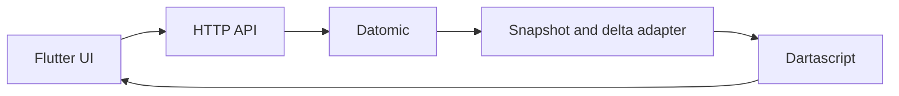
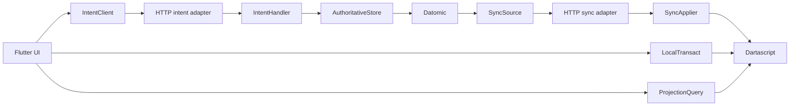

# SMERF ClojureDart MVP Rebuild Plan

The MVP rebuild delivers one complete campaign-to-play journey with the
simplest practical architecture:

Datomic is authoritative. Dartascript is the frontend's queryable local
projection. Portable `.cljc` data shapes form the boundary between them.

The [Full Rebuild Plan](../Full%20Rebuild/CLOJUREDART_REBUILD_PLAN.md) remains
the reference for future production hardening. It does not block the MVP.

## MVP outcome

A user can:

1. Launch the Flutter application.
2. Load a seeded campaign from Datomic.
3. Select the campaign.
4. View its ruleset, world, and characters.
5. Create a character and edit its notes.
6. Open the character play view.
7. Update notes and wounds.
8. Make a server-authoritative roll.
9. See authoritative changes arrive in Dartascript through synchronization.

## Working principles

- Use clear interfaces at real architectural boundaries, even when the MVP has
  only one implementation.
- Keep each interface small, domain-named, and defined by the current
  campaign-to-play journey.
- Frameworks and generalized abstractions are welcome when they make current
  behavior easier to understand, test, or compose. Do not generalize around
  hypothetical future requirements.
- Implement the happy path plus clear user-visible failures.
- Keep the MVP wire and projection shapes unversioned; deploy the MVP client
  and backend together. Version negotiation remains in Full Rebuild.
- Keep frontend-owned implementation namespaces in `.cljd`; use `.cljc` only
  for code intentionally shared with the JVM domain/backend.
- Keep future expansion notes beside the relevant interface or adapter so the
  present behavior remains obvious.
- Preserve logical IDs at boundaries; never send Datomic or Dartascript entity
  IDs over the wire.
- Read synchronized application data from Dartascript, not directly from HTTP
  responses.

## Active architecture

The MVP uses seven explicit interfaces:

- `IntentClient`: sends a domain intent and returns an accepted or rejected
  result.
- `IntentHandler`: dispatches supported intents to current backend operations.
- `AuthoritativeStore`: exposes only the Datomic reads and transactions needed
  by the current journey.
- `SyncSource`: produces a snapshot or the deltas after a cursor.
- `SyncApplier`: applies backend snapshots and deltas to the synchronized
  Dartascript zone.
- `LocalTransact`: applies client-owned navigation, selection, and other local
  actions to the local Dartascript zone.
- `ProjectionQuery`: reads synchronized and local facts and returns data shaped
  for frontend controllers and views.

Each interface should fit in one focused namespace and expose concrete
functions or a small function map. Use a protocol only when runtime
polymorphism makes the implementation clearer. The interfaces isolate effects;
they are not intended to form a generic application framework.

### Shared domain

`domain/` owns only portable data required by the MVP:

- canonical logical IDs;
- campaign, ruleset, world, character, action, and roll shapes;
- intent and result shapes;
- logical synchronization facts;
- snapshot and delta shapes;
- basic context-free validation;
- the existing tagged-JSON codec.

The existing registry foundation may be reused, but the MVP will not expand it
into a generalized schema-evolution system.

### Backend

`backend/` owns:

- Datomic schema and seed loading;
- the `AuthoritativeStore` Datomic adapter;
- the `IntentHandler` for currently supported operations;
- the `SyncSource` snapshot/delta adapter;
- simple HTTP request handlers;
- character creation and updates;
- wound, note, and roll operations;
- snapshot construction;
- Datomic transaction-range to logical-delta conversion.

Intent handlers call the small authoritative-store interface rather than
embedding Datomic calls. The Datomic adapter may remain straightforward and
operation-specific. Durable orchestrators, effect systems, generic action
plans, and workflow persistence are deferred.

### Frontend

`frontend/` owns:

- Flutter screens and navigation;
- the HTTP `IntentClient` adapter;
- the Dartascript `SyncApplier`, `LocalTransact`, and `ProjectionQuery`
  adapters;
- one Dartascript database;
- snapshot and delta application;
- polling from the last applied cursor;
- simple controllers or local widget state;
- queries that turn Dartascript facts into view data.

UI controllers depend on `IntentClient`, `LocalTransact`, and
`ProjectionQuery`, not on HTTP or Dartascript directly. The synchronization
poller depends on `SyncApplier`. The MVP does not require a broad
state-management framework or a complete UI component taxonomy.

## Progress

- [x] Foundation tracer and cross-runtime tagged-JSON codec
- [x] [Slice 0 — Simplify the existing foundation](00-simplify-existing-foundation/PLAN.md)
- [x] [Slice 1 — Minimal domain and sync contracts](01-minimal-domain-sync-contracts/PLAN.md)
- [ ] [Slice 2 — Seeded Datomic backend](02-seeded-datomic-backend/PLAN.md) — next
- [ ] [Slice 3 — Snapshot and polling-delta synchronization](03-snapshot-delta-sync/PLAN.md)
- [ ] [Slice 4 — Campaign browsing frontend](04-campaign-browsing-frontend/PLAN.md)
- [ ] [Slice 5 — Character builder](05-character-builder/PLAN.md)
- [ ] [Slice 6 — Character play](06-character-play/PLAN.md)
- [ ] [Slice 7 — MVP acceptance pass](07-mvp-acceptance/PLAN.md)

## Slice 0 — Simplify the existing foundation

### Deliver

- Inventory the current Full Rebuild implementation by actual runtime consumer.
- Preserve the working tracer, codec, canonical IDs, and dependency rules.
- Reduce or remove generalized registry, wire-policy, and version-family code
  that exists only for deferred requirements.
- Keep only code used by the running foundation or immediately required by
  Slice 1.
- Keep future expansion guidance as concise comments at real adapter seams.

### Accept

- Existing JVM, ClojureDart, formatting, linting, compile, and Flutter checks
  remain green.
- Every retained public abstraction has a current or immediate Slice 1
  consumer.
- The active foundation contains fewer concepts and less code while preserving
  the working end-to-end tracer.

### Defer

No new product behavior is implemented in this slice. Snapshot/delta
contracts, persistence, synchronization, and UI work begin in later slices.

## Slice 1 — Minimal domain and sync contracts

### Deliver

- Use unversioned MVP intent, result, snapshot, and delta shapes.
- Define logical scalar and reference facts using logical UUIDs.
- Define one snapshot shape containing facts and `current-through`.
- Define one delta shape containing additions, retractions, `from-t`, and
  `current-through`.
- Define small intent, accepted-result, rejected-result, and error shapes.
- Validate required fields, logical IDs, known intent types, and basic value
  types.
- Define the input/output contracts for `IntentClient`, `IntentHandler`,
  `AuthoritativeStore`, `SyncSource`, `SyncApplier`, `LocalTransact`, and
  `ProjectionQuery`.

### Accept

- Identical fixtures pass on JVM and ClojureDart.
- No storage entity ID appears in a fixture.
- A snapshot and a following delta can represent one character update.

### Defer

Version fields, negotiation, per-attribute versions, storage manifests,
migration matrices, scope epochs, and exhaustive malformed-input
classification.

## Slice 2 — Seeded Datomic backend

### Deliver

- A small Datomic schema for campaigns, rulesets, worlds, characters, actions,
  and roll results.
- One repeatable development seed containing a campaign, ruleset, world,
  example characters, and basic actions.
- Direct query functions for the campaign workspace.
- Direct transactions for character creation, notes, wounds, and rolls.
- Implement those operations behind the narrow `AuthoritativeStore` interface.
- Implement intent dispatch through `IntentHandler`.
- HTTP endpoints:
  - `GET /api/sync/snapshot`
  - `GET /api/sync/delta?from-t=...`
  - `POST /api/intents`

Use one fixed development principal and one unfiltered projection.

### Accept

- A backend integration test seeds Datomic, reads the campaign, updates a
  character, and observes the committed result.

### Defer

Authentication providers, campaign membership authorization, command
idempotency records, concurrency policies beyond normal Datomic transaction
semantics, and general CRUD.

## Slice 3 — Snapshot and polling-delta synchronization

### Deliver

- Convert Datomic subjects and references to logical IDs.
- Build a full logical snapshot at one Datomic basis.
- Read transactions after a client cursor and formulate logical deltas.
- Implement snapshot/delta reads through `SyncSource`.
- Return a fresh snapshot when a cursor is missing or unusable.
- Apply snapshots and deltas atomically through `SyncApplier` to one
  Dartascript database.
- Apply navigation and other client-owned changes only through
  `LocalTransact`.
- Serve all frontend reads through `ProjectionQuery`, which may combine
  synchronized and local facts.
- Store the last applied Datomic `t`.
- Poll for deltas at startup, after a successful command, and on a simple
  interval while the app is active.

### Accept

- Applying a snapshot and subsequent delta yields the same character state as
  a fresh snapshot.
- Internal Datomic and Dartascript entity IDs may differ without affecting the
  visible result.

### Defer

WebSockets, authorization filtering, replay journals, delivery acknowledgments,
overlap recovery, resumable snapshots, checksums, compression, and sync-status
heartbeats.

## Slice 4 — Campaign browsing frontend

### Deliver

- Replace the placeholder Flutter screen with:
  - campaign list;
  - campaign overview;
  - ruleset view;
  - world view;
  - character list;
  - character detail.
- Bootstrap from the sync snapshot.
- Query all displayed domain facts from Dartascript.
- Keep HTTP and Dartascript access behind `IntentClient`, `SyncApplier`,
  `LocalTransact`, and `ProjectionQuery`.
- Provide basic loading, empty, and error states.
- Use straightforward navigation suitable for the supported Flutter targets.

### Accept

- A user can launch the app and browse from the seeded campaign to its
  ruleset, world, and characters.

### Defer

Deep-link synchronization, persisted navigation, elaborate responsive layouts,
golden-test coverage, full design-system layering, and accessibility hardening.

## Slice 5 — Character builder

### Deliver

- Create a character with the minimum required fields.
- Edit character name, notes, and basic ruleset selections.
- Submit changes through `POST /api/intents`.
- Poll and apply the resulting delta.
- Render the updated character from Dartascript.

### Accept

- A newly created character appears in the campaign character list and remains
  available after restarting the backend and frontend.

### Defer

Multi-step creation workflows, advanced ancestry/resource composition,
optimistic updates, drafts shared across devices, and conflict resolution.

## Slice 6 — Character play

### Deliver

- Display ruleset-derived basic stats and wounds.
- Update wounds and notes.
- Select a seeded action and submit a roll.
- Calculate dice and outcome on the backend.
- Return the immediate roll result and persist any authoritative roll record.
- Synchronize resulting state into Dartascript.

### Accept

- A user can open a character, change wounds, make a roll, see the result, and
  observe synchronized authoritative state.

### Defer

Advanced action building, inventory modifiers, splinters, pool
split/combination, reproducibility controls, saved-roll browsing, and offline
play.

## Slice 7 — MVP acceptance pass

### Deliver

- One integrated happy-path test covering seed → snapshot → browse → create or
  edit character → roll/update → delta → rerender.
- JVM and ClojureDart contract tests.
- Backend Datomic integration tests.
- Snapshot and delta application tests.
- Focused Flutter widget tests for the primary journey.
- Updated developer startup instructions.

### Accept

- `clojure -M:test`
- `clojure -M:test:cljd test smerf.domain.contract-test`
- `clojure -M:format`
- `clojure -M:lint`
- `clojure -M:check`
- `clojure -M:cljd compile`
- `flutter analyze`
- The campaign-to-play journey works against a fresh seeded database.

## Post-MVP expansion

Use the Full Rebuild Plan when requirements justify:

- authentication and multi-principal authorization;
- audience-filtered projections and scope rotation;
- WebSocket fanout and robust replay/recovery;
- command idempotency and explicit concurrency policies;
- durable workflows;
- offline commands and optimistic state;
- generalized schema compatibility and migrations;
- complete inventory, authoring, and advanced roll journeys;
- production observability, backup, performance, and cutover work.

Future-facing comments should be placed only at concrete seams—for example,
the seven MVP interfaces and their HTTP, Datomic, sync, and Dartascript
adapters. Comments should explain a likely extension in terms of the current
boundary without introducing unused types, methods, or implementations.
